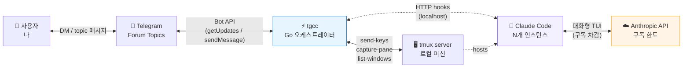
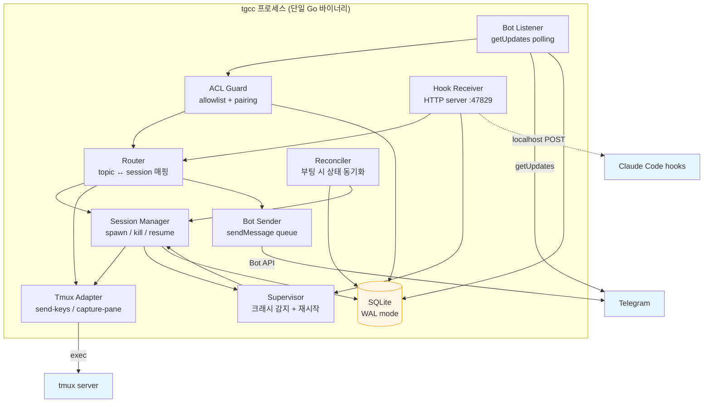
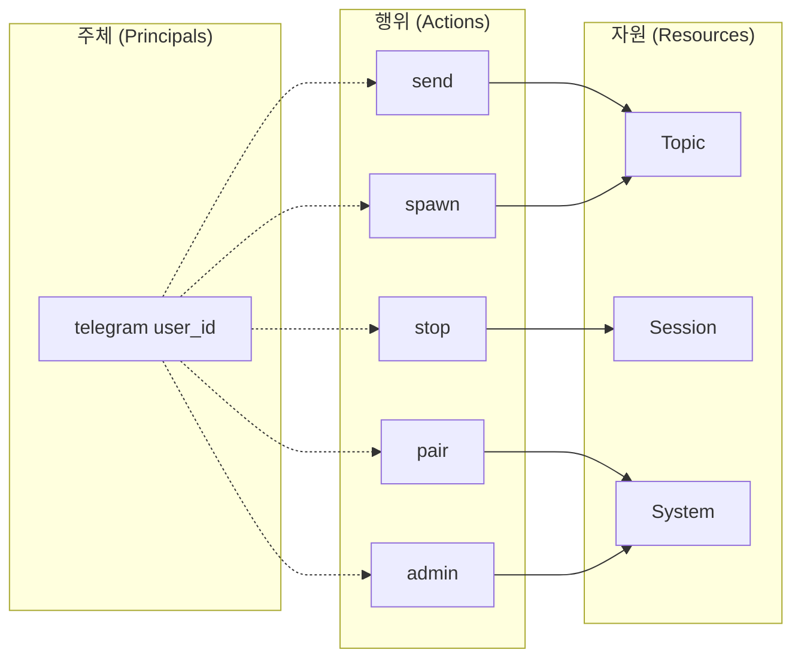
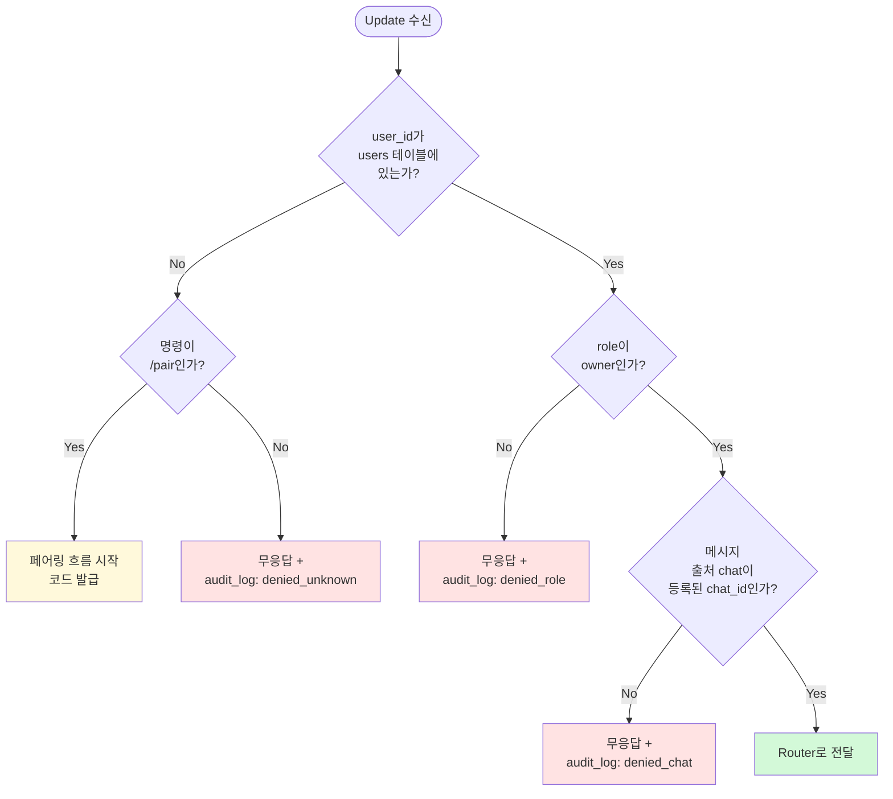
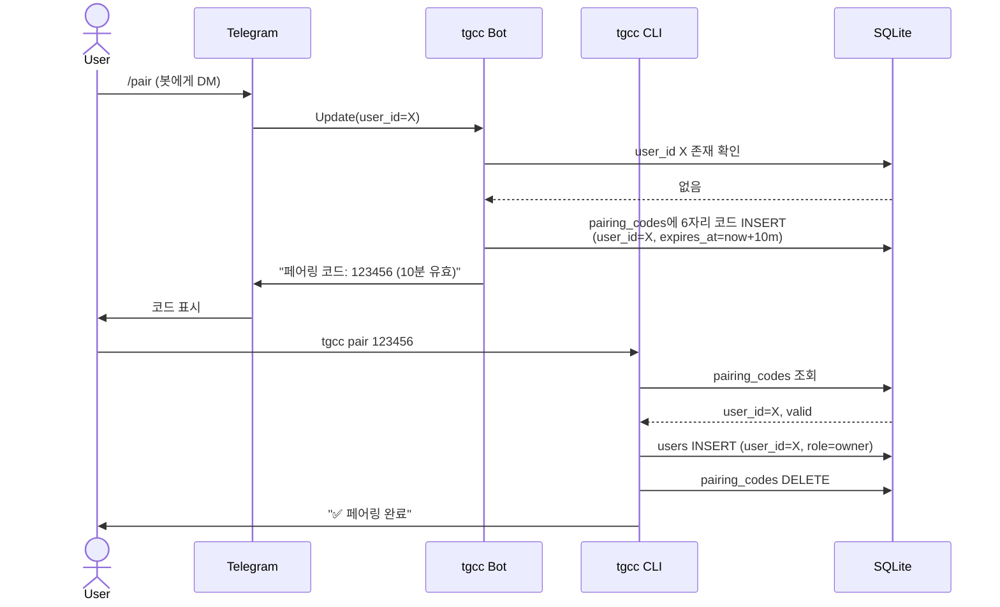
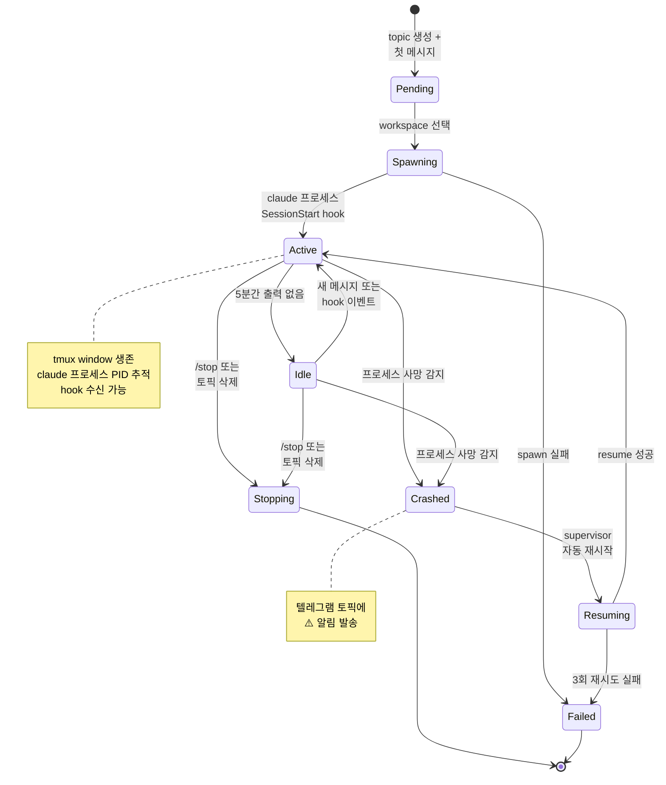

# tgcc — 아키텍처 (Architecture)

> 다이어그램, ACL 모델, 상태 머신, 데이터 스키마

---

## 1. 시스템 컨텍스트



**핵심 원칙**: Claude Code는 항상 **대화형 TUI**로 실행. tgcc는 외부 조작만 수행하므로 Anthropic은 사용자가 직접 키보드를 친 것과 구분 불가 → 구독 한도에서 차감.

---

## 2. 컴포넌트 다이어그램



### 2.1 컴포넌트 책임

| 컴포넌트 | 책임 | 입력 | 출력 |
|---------|------|------|------|
| Bot Listener | 텔레그램 long-polling, 메시지 수신 | Bot API | Update 이벤트 |
| ACL Guard | 페어링/allowlist 검증, 차단 | Update | 허용 또는 거부 |
| Router | 토픽 ↔ 세션 매핑 조회/생성 | 허용된 Update | Session ref |
| Session Manager | 세션 생애주기 관리 | spawn/kill/resume 명령 | tmux 명령, 상태 변경 |
| Tmux Adapter | tmux CLI 호출 추상화 | 명령 | exec.Cmd 결과 |
| Hook Receiver | Claude hook HTTP 수신 | POST JSON | 이벤트 큐로 dispatch |
| Supervisor | 세션 헬스체크, 재시작 | 헬스 시그널 | 재시작 명령, 알림 |
| Bot Sender | 텔레그램 송신 (rate limit 처리) | 송신 큐 | sendMessage 호출 |
| Reconciler | 부팅 시 SQLite ↔ tmux 동기화 | SQLite, tmux 상태 | 정리/복구 명령 |
| Store | SQLite WAL, 단일 source of truth | 모든 쓰기 | 쿼리 응답 |

---

## 3. ACL 모델

### 3.1 주체 / 자원 / 행위



### 3.2 역할 (Roles) — v0.1

개인용이므로 두 역할만 사용. 데이터 모델은 RBAC 확장 가능하게 설계.

| 역할 | 권한 | 비고 |
|------|------|------|
| `unverified` | `pair`만 가능 | 초기 상태, 페어링 코드 발급 가능 |
| `owner` | 모든 행위 | 페어링 성공 시 자동 부여, 본인 한 명 |

### 3.3 권한 매트릭스

| 행위 \ 역할 | unverified | owner |
|------------|:----------:|:-----:|
| pair (페어링 코드 사용) | ✅ | — |
| send (토픽 메시지 전송) | ❌ | ✅ |
| spawn (새 세션 생성) | ❌ | ✅ |
| stop (세션 종료) | ❌ | ✅ |
| admin (allowlist 관리, 강제 kill) | ❌ | ✅ |

### 3.4 ACL 결정 흐름



### 3.5 페어링 시퀀스



---

## 4. 세션 상태 머신



### 4.1 상태 전이 규칙

| From → To | 트리거 | 부작용 |
|-----------|--------|--------|
| `*` → Pending | 새 토픽에 첫 메시지 | sessions INSERT, "워크스페이스 선택" 프롬프트 |
| Pending → Spawning | 사용자가 workspace 선택 | tmux new-window + claude 실행 |
| Spawning → Active | `SessionStart` hook 수신 (5초 타임아웃) | "✅ ready" 알림 |
| Spawning → Failed | 타임아웃 또는 exec 에러 | "❌ failed" 알림, sessions UPDATE status |
| Active → Idle | 5분간 hook/메시지 없음 | 메모리 캐시 정리 (DB는 유지) |
| Active → Crashed | tmux pane이 dead 상태 감지 | "⚠️ crashed" 알림 |
| Crashed → Resuming | supervisor 트리거 (exp. backoff: 1s, 2s, 4s) | `claude --resume <id>` 실행 |
| Resuming → Active | 새 `SessionStart` hook | "✅ resumed" 알림 |
| Resuming → Failed | 3회 시도 실패 | "❌ resume failed, /new 필요" 알림 |
| `*` → Stopping | `/stop` 또는 토픽 삭제 | tmux kill-window, sessions DELETE |

---

## 5. 데이터 모델 (SQLite 스키마)

```sql
-- users: 인증된 사용자 (v0.1에서는 본인 한 명)
CREATE TABLE users (
    user_id       INTEGER PRIMARY KEY,           -- telegram user_id
    username      TEXT,                          -- @handle (캐시용)
    role          TEXT NOT NULL                  -- 'owner' (v0.1)
                  CHECK(role IN ('owner', 'unverified')),
    created_at    INTEGER NOT NULL,              -- unix ms
    last_seen_at  INTEGER
);

-- pairing_codes: 6자리 일회용 코드 (10분 TTL)
CREATE TABLE pairing_codes (
    code        TEXT PRIMARY KEY,                -- 6자리 숫자
    user_id     INTEGER NOT NULL,
    expires_at  INTEGER NOT NULL,                -- unix ms
    used_at     INTEGER,                         -- 사용 시각 (NULL = 미사용)
    created_at  INTEGER NOT NULL
);
CREATE INDEX idx_pairing_expires ON pairing_codes(expires_at);

-- chats: 봇이 활동하는 텔레그램 채팅 (그룹/슈퍼그룹)
CREATE TABLE chats (
    chat_id      INTEGER PRIMARY KEY,            -- telegram chat_id (음수)
    title        TEXT,
    is_forum     INTEGER NOT NULL DEFAULT 1,     -- Forum Topics 활성?
    registered_by INTEGER NOT NULL REFERENCES users(user_id),
    registered_at INTEGER NOT NULL
);

-- topics: 텔레그램 Forum Topic
CREATE TABLE topics (
    id              INTEGER PRIMARY KEY AUTOINCREMENT,
    chat_id         INTEGER NOT NULL REFERENCES chats(chat_id),
    thread_id       INTEGER NOT NULL,            -- telegram message_thread_id
    name            TEXT,                        -- 캐시
    workspace_path  TEXT,                        -- 절대 경로 (null = 미선택)
    created_at      INTEGER NOT NULL,
    UNIQUE(chat_id, thread_id)
);
CREATE INDEX idx_topics_chat ON topics(chat_id);

-- sessions: Claude Code 세션 인스턴스
CREATE TABLE sessions (
    id              TEXT PRIMARY KEY,            -- UUID
    topic_id        INTEGER NOT NULL REFERENCES topics(id) ON DELETE CASCADE,
    tmux_session    TEXT NOT NULL,               -- tmux session name
    tmux_window     TEXT NOT NULL,               -- tmux window name 또는 idx
    workspace_path  TEXT NOT NULL,
    claude_session_id TEXT,                      -- Claude Code 내부 session_id (--resume용)
    pid             INTEGER,                     -- 마지막 알려진 PID
    status          TEXT NOT NULL                -- 상태 머신 참조
                    CHECK(status IN (
                      'pending', 'spawning', 'active', 'idle',
                      'crashed', 'resuming', 'stopping', 'stopped', 'failed'
                    )),
    last_activity_at INTEGER NOT NULL,
    created_at      INTEGER NOT NULL,
    UNIQUE(topic_id)                             -- 토픽당 활성 세션 1개
);
CREATE INDEX idx_sessions_status ON sessions(status);
CREATE INDEX idx_sessions_activity ON sessions(last_activity_at);

-- message_offsets: 토픽별 마지막 전송 메시지 추적 (중복 방지)
CREATE TABLE message_offsets (
    session_id  TEXT PRIMARY KEY REFERENCES sessions(id) ON DELETE CASCADE,
    last_hook_event_id TEXT,                     -- hook payload의 event id
    last_capture_hash  TEXT,                     -- capture-pane 마지막 해시 (fallback)
    updated_at  INTEGER NOT NULL
);

-- audit_log: 모든 ACL 결정과 주요 상태 변경
CREATE TABLE audit_log (
    id          INTEGER PRIMARY KEY AUTOINCREMENT,
    timestamp   INTEGER NOT NULL,                -- unix ms
    actor_user_id INTEGER,                       -- null이면 시스템
    event_type  TEXT NOT NULL,                   -- 'auth.denied', 'session.spawn', ...
    resource    TEXT,                            -- 'session:abc-123', 'topic:5'
    detail      TEXT                             -- JSON
);
CREATE INDEX idx_audit_time ON audit_log(timestamp);
CREATE INDEX idx_audit_actor ON audit_log(actor_user_id);

-- system_meta: 단일 행 키/값 (schema_version, bot_token_hash 등)
CREATE TABLE system_meta (
    key    TEXT PRIMARY KEY,
    value  TEXT NOT NULL
);
```

### 5.1 reconcile 로직 (부팅 시)

```mermaid
flowchart TD
    BOOT[tgcc 시작] --> LOAD[SQLite에서<br/>status IN active/idle/resuming<br/>세션 조회]
    LOAD --> LIST[tmux list-windows -F]
    LIST --> COMPARE{각 세션마다<br/>tmux window<br/>존재?}
    COMPARE -->|Yes + 프로세스 alive| MARK_ACTIVE[status = active<br/>memory cache 재생성]
    COMPARE -->|Yes + 프로세스 dead| MARK_CRASHED[status = crashed<br/>supervisor 큐에 push]
    COMPARE -->|No| MARK_LOST[status = failed<br/>topic에 "session lost" 알림]
    MARK_CRASHED --> NOTIFY1[topic에<br/>"⚠️ crashed, resuming..."]
    MARK_LOST --> NOTIFY2[topic에<br/>"❌ session lost<br/>/new to start fresh"]
    MARK_ACTIVE --> READY[정상 운영 시작]
    NOTIFY1 --> READY
    NOTIFY2 --> READY
```

---

## 6. 디렉토리 구조

### 소스 트리

```
tgcc/
├── cmd/
│   └── tgcc/
│       └── main.go              # 진입점, CLI 파싱 (init/pair/serve/...)
├── internal/
│   ├── bot/                     # 텔레그램 Bot API 어댑터
│   │   ├── listener.go          # long-polling
│   │   ├── sender.go            # 송신 큐 + rate limit
│   │   └── api.go               # getUpdates / sendMessage 등 thin wrapper
│   ├── acl/                     # 인증/권한
│   │   ├── guard.go             # 결정 흐름 (3.4)
│   │   └── pairing.go           # 6자리 코드 발급/검증
│   ├── router/                  # 토픽 ↔ 세션 라우팅
│   │   └── router.go
│   ├── session/                 # 세션 라이프사이클
│   │   ├── manager.go           # spawn/kill/resume
│   │   ├── supervisor.go        # 헬스체크, 재시작
│   │   ├── statemachine.go      # 상태 전이 규칙
│   │   └── reconciler.go        # 부팅 시 동기화
│   ├── tmux/                    # tmux CLI 어댑터
│   │   ├── adapter.go           # exec.Cmd wrapper
│   │   └── parser.go            # list-windows 출력 파싱
│   ├── hook/                    # Claude Code hook 수신
│   │   ├── server.go            # HTTP :47829
│   │   └── handlers.go          # SessionStart/Stop/Notification/...
│   ├── store/                   # SQLite 액세스 계층
│   │   ├── store.go             # 연결, 마이그레이션
│   │   ├── users.go
│   │   ├── topics.go
│   │   ├── sessions.go
│   │   └── audit.go
│   └── config/                  # .env 로딩, 검증
│       └── config.go
├── migrations/
│   └── 0001_init.sql            # 위의 CREATE TABLE 묶음
├── go.mod
├── go.sum
└── README.md
```

### 런타임 파일 (바이너리 옆)

모든 런타임 파일은 tgcc 바이너리와 동일한 디렉토리에 위치한다 (`bin/` 또는 설치 경로).
`TGCC_DB_PATH`, `TGCC_TOML_PATH` 환경변수로 개별 오버라이드 가능.

```
{exe_dir}/          # 바이너리가 있는 디렉토리 (예: /opt/tgcc/bin/)
├── tgcc            # 바이너리
├── .env            # 시크릿 (TELEGRAM_BOT_TOKEN 등), chmod 600
├── tgcc.toml       # 설정 (context 임계값, Honcho, 토픽 매핑)
├── state.db        # SQLite WAL 데이터베이스, chmod 600
└── migrations/     # SQL 마이그레이션 (빌드 시 복사됨)
    ├── 0001_init.sql
    └── ...
```

### 워크스페이스 실제 예시 (ccgram 그룹)

```
{exe_dir}/workspace/
├── ccgram/                      # 텔레그램 그룹명
│   ├── infra/CLAUDE.md
│   ├── dev/CLAUDE.md
│   ├── gpu/CLAUDE.md
│   ├── devops/CLAUDE.md
│   ├── game-dev/CLAUDE.md
│   └── general/CLAUDE.md
└── hongbot-group/
    └── general/CLAUDE.md
```

tgcc.toml의 `[[topic]]`에 `workspace_path`를 지정하면 tgcc 시작 시 DB에 자동 sync된다.
`bin/` 전체는 `.gitignore` 대상이므로 워크스페이스 파일은 배포 시 수동 생성한다.

---

## 7. 동시성 모델

- **메인 goroutine**: signal 처리, 종료 시 graceful shutdown 조율.
- **Bot Listener**: 1 goroutine. getUpdates long-poll → 채널로 dispatch.
- **Bot Sender**: 1 goroutine. 송신 큐 소비, 텔레그램 rate limit (초당 30) 준수.
- **Hook Server**: 1 goroutine + 요청당 goroutine (net/http 기본).
- **Session goroutine**: 토픽당 1개. 메시지 채널 + hook 이벤트 채널 + supervisor tick을 select.
- **Supervisor**: 1 goroutine. 5초 간격 tick으로 모든 active/idle 세션 헬스체크.
- **Reconciler**: 1회성 (부팅 시).

채널은 buffered (크기 16) 사용. SQLite는 단일 `*sql.DB` 공유 (내부 connection pool).

---

## 8. 외부 의존성

| 의존성 | 용도 | 버전 |
|--------|------|------|
| `github.com/go-telegram/bot` 또는 `mymmrac/telego` | Bot API 클라이언트 | 최신 stable |
| `modernc.org/sqlite` | 순수 Go SQLite (CGO 불필요, 단일 바이너리) | 최신 |
| `github.com/google/uuid` | session id 생성 | 최신 |
| (옵션) `github.com/creack/pty` | PTY 폴백 모드 (v0.2) | — |

표준 라이브러리: `os/exec`, `net/http`, `encoding/json`, `database/sql`, `context`, `log/slog`.

---

## 9. 보안 고려사항

| 위협 | 완화 |
|------|------|
| 봇 토큰 유출 | `.env` chmod 600, 로그에 마스킹, SQLite에 토큰 자체는 저장 안 함 (해시만) |
| 알 수 없는 사용자 접근 | ACL 결정 흐름 (3.4), audit_log 기록 |
| 페어링 코드 brute force | 6자리 숫자, 10분 TTL, 시도당 sleep 1초, 5회 실패 시 IP 차단 (v0.2) |
| 임의 명령 실행 | tmux send-keys에 들어가는 내용은 사용자 메시지 그대로 — Claude Code 자체 권한 시스템에 위임 |
| SQLite 파일 노출 | `{exe_dir}/state.db`, chmod 600 |
| Hook 엔드포인트 외부 노출 | 127.0.0.1만 bind, 공유 시크릿 헤더 검증 |
