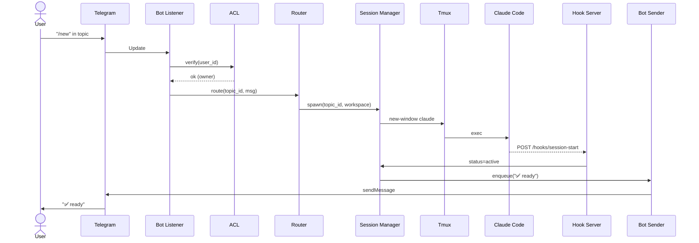
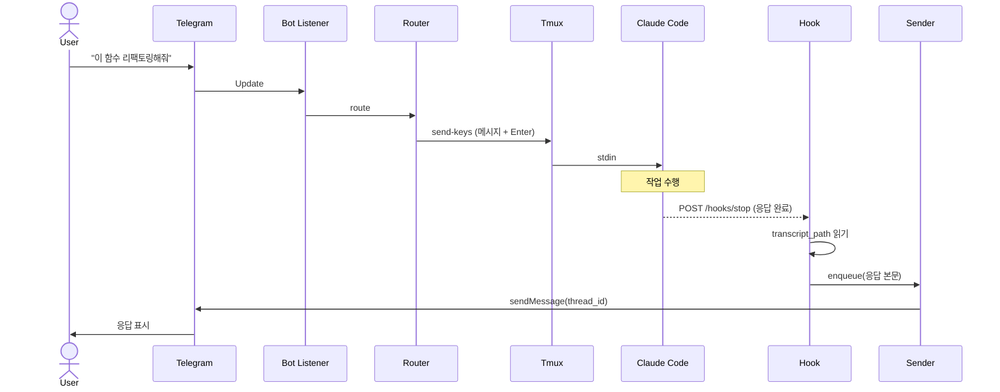
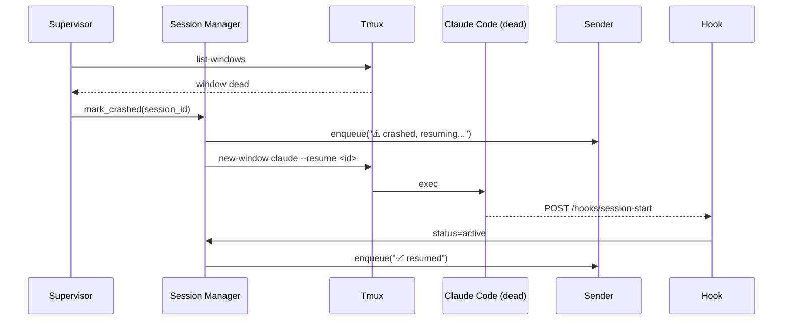

# tgcc — API 명세서

> 세 가지 인터페이스를 정의:
> 1. **텔레그램 봇 커맨드** — 사용자와 직접 상호작용
> 2. **Claude Code Hook 인터페이스** — Claude Code → tgcc HTTP 수신
> 3. **CLI 커맨드** — 로컬 운영 (init, pair, serve, ...)
> 4. **내부 HTTP API** — 디버깅·운영용 (선택)

---

## 1. 텔레그램 봇 커맨드

### 1.1 사용 환경

- DM (1:1 채팅): `/pair`만 허용 (페어링 흐름)
- 그룹 일반 영역: `/register`만 허용 (그룹을 chats 테이블에 등록)
- Forum Topic 안: 그 외 모든 명령 및 일반 메시지

### 1.2 커맨드 일람

| 명령 | 사용 위치 | 권한 | 설명 |
|------|----------|------|------|
| `/start` | DM, 그룹 | any | 봇 소개, 페어링 안내 |
| `/pair` | DM | unverified | 6자리 페어링 코드 발급 |
| `/register` | 그룹 일반 | owner | 그룹을 chats에 등록 (Forum Topics 활성 필요) |
| `/new [workspace]` | Topic | owner | 현재 토픽에 새 Claude 세션 생성 |
| `/resume` | Topic | owner | 마지막 종료된 세션 복구 |
| `/stop` | Topic | owner | 현재 토픽 세션 종료 |
| `/kill` | Topic | owner | 강제 종료 (graceful 실패 시) |
| `/status` | Topic | owner | 현재 토픽 세션 상태 표시 |
| `/list` | Topic, DM | owner | 모든 활성 세션 목록 |
| `/workspaces` | Topic | owner | 사용 가능한 디렉토리 목록 |
| `/help` | any | any | 명령 도움말 |
| `/whoami` | any | any | 본인의 user_id, role 표시 |

### 1.3 상세 명세

#### 1.3.1 `/start`

```
사용처: DM 또는 그룹
권한: any
응답:
  - unverified 사용자 → 페어링 안내 메시지
  - owner → 활성 세션 수 + /help 안내
```

**응답 예시 (unverified):**
```
👋 tgcc에 오신 것을 환영합니다.

이 봇을 사용하려면 페어링이 필요합니다:
1. 이 채팅에서 /pair 입력
2. 받은 6자리 코드를 터미널에서 `tgcc pair <코드>` 입력
```

#### 1.3.2 `/pair`

```
사용처: DM 전용
권한: unverified (이미 owner면 거부)
파라미터: 없음
동작:
  1. 호출자 user_id 추출
  2. pairing_codes에서 해당 user_id의 미사용 코드 조회
     - 있으면 그것 반환
     - 없으면 6자리 무작위 코드 생성, expires_at = now + 10분
  3. 코드를 답장으로 전송
```

**응답 예시:**
```
🔑 페어링 코드: 738291
유효 시간: 10분

터미널에서 다음 명령을 실행하세요:
  tgcc pair 738291
```

#### 1.3.3 `/register`

```
사용처: 그룹 일반 영역 (Topic 밖)
권한: owner
파라미터:
  - honcho_session=<session-id> (선택): Honcho 세션 ID 설정
동작:
  1. chat 객체의 is_forum 확인
  2. is_forum이 false면 거부 + "Forum Topics 활성화 필요" 안내
  3. chats 테이블에 INSERT OR REPLACE
  4. honcho_session_id가 있으면 해당 토픽의 Honcho 세션 ID 업데이트
  5. audit_log 기록
응답: ✅ 성공 또는 ❌ 사유
```

**성공 응답:**
```
✅ 그룹 "team-coding"이 등록되었습니다.
이제 토픽을 생성하고 메시지를 보내면 Claude 세션이 시작됩니다.
```

**실패 응답 (Forum 비활성):**
```
❌ 이 그룹은 Forum Topics가 활성화되어 있지 않습니다.
그룹 설정 → "토픽" 활성화 후 다시 시도하세요.
```

#### 1.3.4 `/new [workspace]`

```
사용처: Forum Topic 안
권한: owner
파라미터:
  - workspace (선택): 워크스페이스 경로 또는 별칭
동작:
  1. 현재 토픽에 이미 active/idle 세션이 있으면 거부 + 현재 상태 표시
  2. workspace 미지정이면 /workspaces 결과를 인라인 키보드로 제시
  3. workspace 확정 후:
     a. sessions INSERT (status=spawning)
     b. tmux new-window 실행
     c. claude 프로세스 spawn (tmux new-window)
     d. 2초 sleep 후 status=active 로 전환 (fallback)
  4. SessionStart hook 수신 시 correlation_id(cwd) 기반 매칭으로 claude_session_id 갱신
  5. spawn 실패 시 status=failed
```

**인라인 키보드 예시 (workspace 미지정):**
```
워크스페이스를 선택하세요:
┌────────────────────────┐
│ 📁 ~/projects/api      │
│ 📁 ~/projects/web      │
│ 📁 ~/projects/scripts  │
│ ❌ 취소                 │
└────────────────────────┘
```

#### 1.3.5 `/resume`

```
사용처: Forum Topic 안
권한: owner
동작:
  1. 현재 토픽에 status IN (crashed, stopped, failed) 세션 조회
  2. claude_session_id가 있는 가장 최근 세션 사용
  3. `claude --resume <claude_session_id>` 로 새 tmux window 생성
  4. 성공 시 status=active, "✅ resumed"
  5. 실패 시 "❌ resume failed, /new <workspace>로 새로 시작하세요"
```

#### 1.3.6 `/stop`

```
사용처: Forum Topic 안
권한: owner
동작:
  1. sessions 조회
  2. status=stopping 으로 변경
  3. tmux send-keys "/exit\n" + 5초 대기 (graceful 종료 유도)
  4. 5초 후 tmux kill-window 즉시 실행
  5. status=stopped
```

#### 1.3.7 `/kill`

```
사용처: Forum Topic 안
권한: owner
동작:
  1. tmux kill-window 즉시 실행
  2. status=stopped
  3. supervisor가 재시작 시도하지 않도록 플래그
응답: 🛑 강제 종료됨
```

#### 1.3.8 `/status`

```
사용처: Forum Topic 안
권한: owner
응답: 현재 세션의 상태, 워크스페이스, 마지막 활동, PID 표시
```

**응답 예시:**
```
📊 세션 상태

ID: 7a3f-...
상태: active
워크스페이스: ~/projects/api
PID: 84321
시작: 2시간 23분 전
마지막 활동: 12초 전
tmux: tgcc:api-refactor
```

#### 1.3.9 `/list`

```
사용처: Topic 또는 DM
권한: owner
응답: 모든 등록된 토픽과 세션 상태 표
```

**응답 예시:**
```
📋 세션 목록 (3개)

🟢 api-refactor    active     ~/projects/api
🟡 web-bugfix      idle       ~/projects/web   (18분)
🔴 data-pipeline   crashed    ~/projects/data  (재시작 중)
```

#### 1.3.10 `/workspaces`

```
응답: tgcc.toml의 workspace_roots 하위 디렉토리를 스캔해서 인라인 키보드
```

### 1.4 일반 메시지 처리

토픽 안의 비명령 메시지는 다음 흐름:

```
1. ACL 검증
2. 토픽에 활성 세션이 있는가?
   - 있음: tmux send-keys로 Claude에 전달
   - 없음: /new 안내
3. Claude의 응답은 Stop hook으로 받아 토픽에 송신
```

### 1.5 오류 메시지 표준

| 코드 | 메시지 |
|------|--------|
| AUTH_DENIED | (응답 없음, audit_log만) |
| TOPIC_NO_SESSION | "이 토픽에 활성 세션이 없습니다. `/new <workspace>`로 시작하세요." |
| SESSION_BUSY | "Claude가 작업 중입니다... ⏳" |
| SPAWN_TIMEOUT | "❌ Claude Code 시작 실패 (timeout). 로그를 확인하세요." |
| WORKSPACE_NOT_FOUND | "❌ 워크스페이스를 찾을 수 없습니다: `{path}`" |
| RESUME_FAILED | "❌ 복구 실패. `/new`로 새로 시작하세요." |

---

## 2. Claude Code Hook 인터페이스

tgcc는 `127.0.0.1:47829`에 HTTP 서버를 띄우고, Claude Code의 `~/.claude/settings.json` 또는 프로젝트별 `.claude/settings.json`에 hook을 등록한다.

### 2.1 Hook 등록 예시

```json
{
  "hooks": {
    "SessionStart": [
      {
        "matcher": "",
        "hooks": [
          {
            "type": "command",
            "command": "curl -s -X POST -H 'X-tgcc-Token: $TGCC_HOOK_TOKEN' -H 'Content-Type: application/json' --data-binary @- http://127.0.0.1:47829/hooks/session-start"
          }
        ]
      }
    ],
    "Stop": [
      {
        "matcher": "",
        "hooks": [
          {
            "type": "command",
            "command": "curl -s -X POST -H 'X-tgcc-Token: $TGCC_HOOK_TOKEN' -H 'Content-Type: application/json' --data-binary @- http://127.0.0.1:47829/hooks/stop"
          }
        ]
      }
    ],
    "Notification": [
      {
        "matcher": "",
        "hooks": [
          {
            "type": "command",
            "command": "curl -s -X POST -H 'X-tgcc-Token: $TGCC_HOOK_TOKEN' -H 'Content-Type: application/json' --data-binary @- http://127.0.0.1:47829/hooks/notification"
          }
        ]
      }
    ]
  }
}
```

`tgcc init`이 위 설정을 자동 생성하거나 안내한다.

### 2.2 공통 헤더

| 헤더 | 값 |
|------|---|
| `Content-Type` | `application/json` |
| `X-tgcc-Token` | `.env`의 `TGCC_HOOK_TOKEN` (32자 랜덤) — 일치하지 않으면 401 |

### 2.3 엔드포인트

#### `POST /hooks/session-start`

Claude Code 세션이 시작되거나 resume되었을 때.

**요청 (Claude Code가 stdin으로 보내는 페이로드 그대로):**
```json
{
  "session_id": "abc-123-...",
  "transcript_path": "/Users/me/.claude/projects/.../session.jsonl",
  "cwd": "/Users/me/projects/api",
  "hook_event_name": "SessionStart",
  "source": "startup"
}
```

**응답:**
```json
{"ok": true}
```

**부작용:**
- `cwd`로부터 매칭되는 session 레코드를 찾아 `claude_session_id`, `status=active` 업데이트
- 대응 토픽에 "✅ session ready" 송신
- audit_log: `session.started`

#### `POST /hooks/stop`

Claude가 응답을 마치고 사용자 입력을 기다릴 때.

**요청:**
```json
{
  "session_id": "abc-123-...",
  "transcript_path": "/...",
  "hook_event_name": "Stop",
  "stop_hook_active": false
}
```

**부작용:**
- transcript_path를 읽어 직전 assistant 메시지 추출
- message_offsets로 중복 체크
- 새 응답이면 토픽에 송신
- `last_activity_at` 갱신

#### `POST /hooks/notification`

Claude가 사용자에게 알림을 보낼 때 (입력 대기 60초, 권한 요청 등).

**요청:**
```json
{
  "session_id": "abc-123-...",
  "hook_event_name": "Notification",
  "message": "Claude needs your permission to use Bash"
}
```

**부작용:**
- 토픽에 알림 메시지 송신
- v0.1에서는 본문만 전달, v0.2에서 인라인 키보드 추가

#### `POST /hooks/pre-tool-use` (v0.2)

권한 승인 인라인 키보드 처리용. v0.1에서는 등록하되 단순 통과.

### 2.4 응답 규약

- 정상: `200 OK`, `{"ok": true}`
- 인증 실패: `401 Unauthorized`
- 페이로드 오류: `400 Bad Request`, `{"error": "..."}`
- 처리 실패: `500 Internal Server Error` (Claude Code는 무시하고 계속 진행)

tgcc는 hook 응답으로 Claude의 동작을 **차단하지 않는다** (v0.1). v0.2에서 PreToolUse에서만 차단 가능.

---

## 3. CLI 커맨드

`tgcc` 바이너리는 다음 서브커맨드를 제공한다.

### 3.1 `tgcc init`

```
용도: 초기 설정
동작:
  1. 바이너리 디렉토리에 migrations/ 생성
  2. .env 템플릿 작성 (TELEGRAM_BOT_TOKEN, TGCC_HOOK_TOKEN 등)
  3. ~/.claude/settings.json 에 hook 자동 등록 안내
```

**예시:**
```bash
$ tgcc init
✅ 초기화 완료: /opt/tgcc/bin
✅ 환경 파일 생성: /opt/tgcc/bin/.env
⚠️  .env 의 TELEGRAM_BOT_TOKEN 을 BotFather에서 받은 토큰으로 설정하세요.
```

### 3.2 `tgcc pair <code>`

```
용도: 페어링 코드 사용해 자신을 owner로 등록
동작:
  1. pairing_codes 조회 (코드, 미만료, 미사용)
  2. 해당 user_id를 users INSERT (role=owner)
  3. 코드를 used 처리
```

### 3.3 `tgcc serve`

```
용도: 메인 데몬 실행
플래그:
  --foreground (-f): 포어그라운드 (기본)
  --log-level: debug/info/warn/error (기본 info)
  --hook-port: 47829 (기본)
동작:
  1. .env 로드, SQLite 연결, 마이그레이션
  2. Reconciler 1회 실행 (부팅 시 상태 동기화)
  3. Bot Listener / Sender / Hook Server / Supervisor 모두 시작
  4. SIGTERM 시 graceful shutdown
```

### 3.4 `tgcc status`

```
용도: 실행 중인 tgcc의 상태 조회 (내부 HTTP API 호출)
응답: 활성 세션 수, 큐 길이, 마지막 hook 수신 시각 등
```

### 3.5 `tgcc list-users` / `tgcc revoke <user_id>` (v0.2)

```
용도: allowlist 관리
```

### 3.6 환경변수 / 설정 파일

`{exe_dir}/.env`:
```bash
TELEGRAM_BOT_TOKEN=123456:ABC...
TGCC_HOOK_TOKEN=<32자 랜덤>
TGCC_LOG_LEVEL=info
TGCC_DB_PATH={exe_dir}/state.db
TGCC_HOOK_PORT=47829
```

`{exe_dir}/tgcc.toml`:
```toml
[context]
soft_warn_bytes     = 80000
hard_compact_bytes  = 150000
fresh_restart_bytes = 300000
soft_warn_turns     = 60
hard_compact_turns  = 100
idle_hibernate_min  = 30

[honcho]
enabled   = true
url       = "http://localhost:8000"
workspace = "work"

[[topic]]
thread_id         = 283
honcho_session_id = "topic-infra"
workspace_path    = "/opt/tgcc/workspace/ccgram/infra"
model             = "claude-sonnet-4-6"
```

---

## 4. 내부 HTTP API (운영용)

`127.0.0.1:47829` (hook 서버와 같은 포트 공유). 모든 엔드포인트는 `X-tgcc-Token` 헤더 필요.

현재 구현된 엔드포인트만 명시.

### 4.1 엔드포인트

| Method | Path | 응답 |
|--------|------|------|
| GET | `/healthz` | `{"status":"ok","uptime_seconds":...}` |
| GET | `/sessions` | 세션 목록 JSON |

### 4.2 응답 예시

#### `GET /sessions`

```json
{
  "sessions": [
    {
      "id": "7a3f-...",
      "topic_id": 5,
      "topic_name": "api-refactor",
      "chat_id": -1001234567890,
      "thread_id": 12,
      "status": "active",
      "workspace_path": "/home/me/projects/api",
      "tmux_window": "tgcc:api-refactor",
      "pid": 84321,
      "claude_session_id": "abc-...",
      "last_activity_at": 1747900000000,
      "created_at": 1747800000000
    }
  ],
  "total": 1
}
```

---

## 5. 시퀀스 다이어그램 모음

### 5.1 토픽 첫 메시지 → 세션 시작



### 5.2 사용자 메시지 → Claude 응답



### 5.3 크래시 → 자동 복구



---

## 6. 비기능 명세

### 6.1 Rate Limit

- 텔레그램 sendMessage: 봇당 초당 30, 같은 채팅당 분당 20. Sender가 토큰 버킷으로 제어.
- 페어링 코드 시도: 같은 user_id에 분당 5회 제한 (v0.2).

### 6.2 에러 처리 정책

| 상황 | 정책 |
|------|------|
| 텔레그램 API 5xx | 지수 백오프 (1s, 2s, 4s, ..., 최대 60s) |
| 텔레그램 API 4xx (메시지 송신) | 1회만 로그 후 drop, audit_log 기록 |
| tmux 명령 실패 | 즉시 audit, 사용자에게 알림 |
| Claude Code 프로세스 spawn 실패 | 3회 재시도 (지수 백오프) 후 failed |
| SQLite busy | 100ms 백오프 + 재시도 (자동, sqlite_busy_timeout 사용) |
| Hook payload 파싱 실패 | 400 응답, audit_log |

### 6.3 로깅

stderr에 structured JSON (`log/slog`):
```json
{"time":"2026-05-19T10:23:45Z","level":"INFO","msg":"session.spawn","topic_id":5,"workspace":"/home/me/projects/api","session_id":"7a3f..."}
```

민감 정보 마스킹: `bot_token`, `pairing_code`, `hook_token`.

---

## 7. 버전 정책

- `tgcc --version` 출력
- SQLite `system_meta` 테이블의 `schema_version` 값
- API 응답 헤더 `X-tgcc-Version`
- breaking change 시 schema_version bump + 마이그레이션 스크립트

v0.1 → v0.2 변경 예정:
- PreToolUse hook + 권한 승인 인라인 키보드
- 파일 첨부 송수신
- allowlist 관리 CLI 확장
