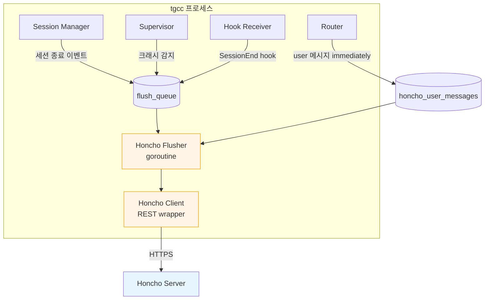
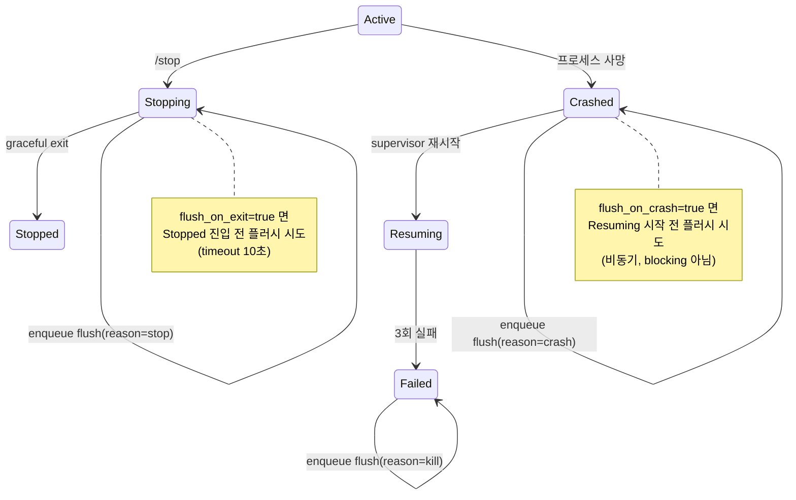

# tgcc — Honcho 통합 (Addendum)

> 기존 v0.1 MVP에 Honcho 메모리 레이어를 통합하는 설계.
> 별도 마일스톤(v0.2) 또는 v0.1에 옵셔널 기능으로 포함 가능.

---

## 1. 통합 목표

1. **공유 메모리**: 모든 토픽의 대화가 하나의 peer 표현에 누적되어, 토픽 간 컨텍스트가 자연스럽게 흐른다.
2. **종료 시 자동 기록**: Claude 세션이 어떤 이유로 종료되든(정상/크래시/강제) transcript가 Honcho에 안전하게 저장된다.
3. **claude-honcho 플러그인과 공존**: 플러그인은 라이브 저장을, tgcc는 안전망을 담당. 중복 방지.
4. **점진적 채택**: `tgcc.toml`의 `[honcho] enabled = false`로 완전히 끌 수 있다.

---

## 2. 메모리 매핑 정책

### 2.1 선택지

| 옵션 | 구조 | 사용 시점 |
|------|------|----------|
| A. **shared-session** | 모든 토픽 → 1개 session_id | 단일 사용자, 토픽 간 대화 혼합 OK |
| B. **shared-peer** ⭐ | 토픽마다 session_id, 모두 같은 peer_name | **기본값 권장** |
| C. **isolated** | 토픽마다 session_id + peer_name 분리 | 토픽 간 정보 차단 필요 시 |

옵션 B가 기본값인 이유: Honcho의 peer 표현은 모든 세션의 메시지에서 누적 빌드되므로, peer만 공유해도 *지식*은 자동 공유된다. 동시에 각 토픽의 대화 흐름은 격리되어 Claude가 토픽을 혼동하지 않는다.

### 2.2 구체적 매핑

| Honcho 개념 | tgcc에서의 값 | 비고 |
|-------------|--------------|------|
| workspace | `tgcc.toml`의 `[honcho] workspace` (기본 `"tgcc"`) | 전역 1개 |
| peer (human) | `[honcho] peer_name` (기본 `$USER`) | v0.1 단일 사용자 |
| peer (AI) | `[honcho] ai_peer` (기본 `"claude"`) | 모든 세션 공통 |
| session | 옵션 A: `[honcho] shared_session_name`<br>옵션 B/C: `tgcc-topic-<topic_id>` | DB의 `topics.honcho_session_id`에 저장 |

### 2.3 멀티 사용자 확장 (v1.0)

`users.honcho_peer_name` 컬럼 추가만으로 가능. peer 표현이 사용자별로 분리되며, 같은 workspace를 공유하면 사용자 간 cross-peer 표현도 빌드됨.

---

## 3. 설정 추가

### 3.1 `tgcc.toml` 추가 섹션

```toml
[honcho]
enabled = true
mode = "shared-peer"          # "shared-session" | "shared-peer" | "isolated"

# 서버
api_base = "https://api.honcho.dev"       # 자체 호스팅이면 http://localhost:8000
api_key_env = "HONCHO_API_KEY"            # 환경변수 이름

# 매핑
workspace = "tgcc"
peer_name = ""                # 빈 값이면 $USER로 자동 채움
ai_peer = "claude"
shared_session_name = "tgcc-shared"        # mode=shared-session에서만 사용

# 플러시 동작
flush_on_exit = true
flush_on_crash = true
flush_interval_seconds = 0    # > 0이면 주기적 incremental flush
flush_timeout_seconds = 10

# claude-honcho 플러그인 연계
plugin_present = true         # true면 라이브 저장은 플러그인에 위임
dedup_window_seconds = 60     # 플러그인이 보냈을 가능성 있는 구간 (HEAD에서 N초)

# 컨텍스트 주입 (옵션, v0.3)
inject_context_at_spawn = false           # spawn 시 representation을 CLAUDE.md에 주입
inject_max_tokens = 2000
```

### 3.2 환경변수 (`.env`)

```bash
HONCHO_API_KEY=hch-v2-...                 # SaaS 또는 자체 호스팅 키
HONCHO_API_BASE=https://api.honcho.dev    # 선택 (tgcc.toml 우선)
```

---

## 4. 데이터 모델 추가

```sql
-- topics: Honcho 세션 매핑 추가
ALTER TABLE topics ADD COLUMN honcho_session_id TEXT;

-- sessions: 플러시 상태 직접 보관 (간단 케이스)
ALTER TABLE sessions ADD COLUMN transcript_path TEXT;

-- Honcho 플러시 상태 (세션당 1행)
CREATE TABLE honcho_flush_state (
    session_id          TEXT PRIMARY KEY REFERENCES sessions(id) ON DELETE CASCADE,
    transcript_path     TEXT NOT NULL,
    last_flushed_byte   INTEGER NOT NULL DEFAULT 0,
    last_flushed_at     INTEGER,
    last_error          TEXT,
    error_count         INTEGER NOT NULL DEFAULT 0
);

-- Honcho 플러시 큐 (재시도 가능)
CREATE TABLE honcho_flush_queue (
    id              INTEGER PRIMARY KEY AUTOINCREMENT,
    session_id      TEXT NOT NULL REFERENCES sessions(id) ON DELETE CASCADE,
    reason          TEXT NOT NULL CHECK(reason IN ('stop', 'crash', 'kill', 'idle', 'periodic', 'boot')),
    enqueued_at     INTEGER NOT NULL,
    attempted_at    INTEGER,
    completed_at    INTEGER,
    error           TEXT
);
CREATE INDEX idx_flush_queue_pending ON honcho_flush_queue(completed_at) WHERE completed_at IS NULL;

-- Honcho 사이드 메시지 로그 (사용자 메시지 즉시 기록, 크래시 대비)
-- Claude의 transcript jsonl에 사용자 입력이 들어가기 전에 죽을 경우 보완
CREATE TABLE honcho_user_messages (
    id              INTEGER PRIMARY KEY AUTOINCREMENT,
    session_id      TEXT NOT NULL REFERENCES sessions(id) ON DELETE CASCADE,
    user_id         INTEGER NOT NULL REFERENCES users(user_id),
    content         TEXT NOT NULL,
    received_at     INTEGER NOT NULL,
    flushed_to_honcho INTEGER NOT NULL DEFAULT 0
);
CREATE INDEX idx_user_msg_pending ON honcho_user_messages(session_id, flushed_to_honcho);
```

---

## 5. 컴포넌트 추가



### 5.1 Honcho Client (`internal/honcho/client.go`)

Go에는 공식 SDK가 없으므로 REST를 직접 호출. 필요한 엔드포인트는 4개뿐.

| 동작 | HTTP |
|------|------|
| workspace 보장 | `PUT /v3/workspaces/{ws}` |
| peer 보장 | `PUT /v3/workspaces/{ws}/peers/{peer}` |
| session 보장 | `PUT /v3/workspaces/{ws}/sessions/{session}` |
| 메시지 배치 추가 | `POST /v3/workspaces/{ws}/sessions/{session}/messages` |

idempotency: 같은 메시지를 두 번 보내지 않기 위해 메시지마다 `metadata.tgcc_msg_id` (transcript jsonl의 timestamp + 해시) 부여. 플러시 전에 같은 session의 최근 메시지를 조회해 중복 제외 가능 (선택). 단순화를 위해 client side dedup만으로도 충분.

### 5.2 Honcho Flusher (`internal/honcho/flusher.go`)

단일 goroutine. 채널 기반 dispatch.

```go
type FlushRequest struct {
    SessionID string
    Reason    string  // "stop" | "crash" | "kill" | "idle" | "periodic" | "boot"
}

func (f *Flusher) Run(ctx context.Context) {
    ticker := time.NewTicker(5 * time.Second)
    for {
        select {
        case req := <-f.requests:
            f.handle(req)
        case <-ticker.C:
            f.drainQueue()  // SQLite 큐에서 미완료 작업 polling
        case <-ctx.Done():
            return
        }
    }
}
```

### 5.3 플러시 알고리즘

```
handle(req):
  1. sessions에서 transcript_path 조회 (없으면 skip)
  2. honcho_flush_state에서 last_flushed_byte 조회 (없으면 0)
  3. transcript_path 파일 size 확인. size <= last_flushed_byte 면 skip
  4. 파일을 [last_flushed_byte, size]로 mmap 또는 seek read
  5. 라인별 파싱:
     - type=user → user 메시지
     - type=assistant → assistant 메시지
     - 그 외 (tool_use, tool_result) → metadata에만 기록 (옵션)
  6. plugin_present=true 면 dedup_window:
     - req.Reason in (stop, periodic): 최근 dedup_window_seconds의 메시지는 스킵 (플러그인이 보냄)
     - req.Reason in (crash, kill, boot): 전체 포함 (플러그인이 못 보냈을 가능성)
  7. honcho_user_messages에서 flushed_to_honcho=0인 행도 함께 수집
     - transcript timestamp와 병합, 시간순 정렬
  8. Honcho에 batch POST (한 번에 최대 100메시지)
  9. 성공 시:
     - last_flushed_byte = file size
     - honcho_user_messages.flushed_to_honcho = 1
     - flush_queue.completed_at 설정
  10. 실패 시:
     - error_count++, last_error 기록
     - exponential backoff (1s, 2s, 4s, 최대 60s)로 재시도
     - 5회 연속 실패하면 audit_log에 기록 후 큐에서 제거
```

### 5.4 사용자 메시지 즉시 로깅

라우터가 텔레그램 → tmux 전달 직후 비동기로:

```
ROUTER.handleUserMessage(msg):
  send-keys to tmux
  go store.InsertHonchoUserMessage(session_id, user_id, content, now())
```

이렇게 하면 Claude가 응답을 시작하기 전에 죽어도 사용자의 마지막 메시지는 보존된다.

---

## 6. 상태 머신 통합

기존 세션 상태 머신에 플러시 부작용을 추가.



각 종료 경로에서 `Flusher.Enqueue(FlushRequest{...})` 호출이 추가됨. 부팅 시 Reconciler도 모든 sessions에 대해 `reason=boot`로 큐에 push.

---

## 7. claude-honcho 플러그인과의 협조

### 7.1 환경변수 주입

`tgcc.toml`의 honcho 설정을 바탕으로 spawn 시 환경변수 주입:

```bash
HONCHO_API_KEY=$(cat ~/.tgcc/.env | grep HONCHO_API_KEY)
HONCHO_WORKSPACE=tgcc
HONCHO_PEER_NAME=alice
HONCHO_AI_PEER=claude
HONCHO_SESSION_NAME=tgcc-topic-5   # mode에 따라
```

또한 사용자의 `~/.honcho/config.json`이 있으면 그것이 우선이므로, `HONCHO_CONFIG_PATH` 환경변수로 tgcc 전용 config를 임시 디렉토리에 생성해 가리키게 한다.

```json
// ~/.tgcc/honcho-runtime.json
{
  "apiKey": "...",
  "peerName": "alice",
  "hosts": {
    "claude_code": {
      "workspace": "tgcc",
      "aiPeer": "claude"
    }
  },
  "sessionStrategy": "chat-instance",
  "sessionPeerPrefix": false
}
```

`sessionStrategy: "chat-instance"` + 환경변수로 명시적 세션명 → 토픽별 분리. 플러그인이 알아서 디렉토리 기반 매핑하지 않게 됨.

### 7.2 중복 방지

플러그인이 라이브로 보내는 메시지와 tgcc Flusher가 보내는 메시지가 겹칠 수 있다. 두 가지 방어선:

1. **시간 기반 dedup**: 정상 종료 시 dedup_window_seconds 안의 메시지는 플러그인이 이미 보냈다고 가정하고 tgcc는 스킵.
2. **Metadata 키**: tgcc가 보낼 때 `metadata.source = "tgcc-flusher"`, 플러그인은 다른 source. Honcho에서 같은 timestamp + 같은 content를 dedup하도록 metadata에 hash 부여.

### 7.3 플러그인 없이도 동작

`plugin_present = false`로 두면 tgcc Flusher가 100% 책임. 이 모드는:
- 라이브 메모리 접근(MCP 도구) 없음 → Claude는 메모리를 직접 조회할 수 없음
- 하지만 모든 대화는 Honcho에 누적 → 다음 세션에서 representation으로 활용 가능
- 단점 보완: `inject_context_at_spawn = true`로 spawn 시 representation을 CLAUDE.md에 prepend

---

## 8. API 명세 추가

### 8.1 내부 HTTP API

| Method | Path | 동작 |
|--------|------|------|
| GET | `/honcho/status` | 플러시 큐 길이, 마지막 성공 시각 |
| POST | `/honcho/flush/{session_id}` | 수동 플러시 트리거 |
| GET | `/honcho/state/{session_id}` | 해당 세션의 last_flushed_byte 등 |

### 8.2 봇 커맨드 추가

| 명령 | 동작 |
|------|------|
| `/memory` | 현재 토픽 세션의 Honcho representation 요약 표시 |
| `/forget` | 현재 토픽 세션을 Honcho에서 삭제 (확인 후) |
| `/memory_search <query>` | Honcho dialectic chat 호출 결과 표시 |

이 명령들은 v0.3 마일스톤. v0.2에서는 백그라운드 플러시만.

---

## 9. 마일스톤 재정의

| 마일스톤 | 범위 | 예상 |
|---------|------|------|
| **v0.2-honcho-a** | Honcho Client + Flusher 골격, 옵션 B(shared-peer), `flush_on_crash`만 | 1주 |
| **v0.2-honcho-b** | 플러그인 환경변수 주입, dedup, 부팅 시 reconcile flush | 0.5주 |
| **v0.3-honcho-c** | `/memory` 명령, representation 주입, dialectic chat 통합 | 1주 |

기존 v0.1 마일스톤(M1~M5)이 끝난 후 시작. v0.1에는 SQLite 컬럼만 미리 만들어두는 정도 (`honcho_session_id`).

---

## 10. 검증 시나리오

| 시나리오 | 기대 동작 |
|---------|----------|
| 정상 `/stop` | 플러그인이 모든 메시지 전송 → tgcc는 dedup_window 안 메시지 스킵 → 신규 메시지 0건 |
| Claude 크래시 | tgcc Flusher가 last_flushed_byte~EOF 전체 전송 → 누락 없음 |
| 봇 강제 종료 후 재시작 | 부팅 시 reconciler가 모든 active 세션의 transcript mtime > last_flushed_at 인 것만 큐에 push |
| 사용자 메시지 직후 크래시 | honcho_user_messages에 즉시 기록 → Flusher가 transcript와 병합 전송 |
| Honcho API 다운 | 큐가 쌓이고 5회 재시도 후 audit_log 기록 → 복구되면 다음 사이클에 재처리 |
| 다른 토픽에서 같은 정보 질문 | peer 표현이 누적되어 있으므로 dialectic chat이 답변 가능 |

---

## 11. 비용 및 프라이버시 고려

| 항목 | SaaS (app.honcho.dev) | 자체 호스팅 |
|------|----------------------|------------|
| 초기 비용 | $100 무료 크레딧 | 0 (LLM 비용만) |
| 운영 비용 | 사용량 종량제 | OpenRouter/Groq 모델별 |
| 대화 노출 | Plastic Labs에 메시지 전송됨 | 자체 머신 |
| E2EE | 불가능 (function calling 필요) | 동일 |
| 추천 | 개인용 빠른 시작 | 민감한 코드베이스 |

자체 호스팅 시 deriver는 빠른 모델(Groq llama), dream/dialectic은 좋은 모델(Claude Sonnet)로 분리하는 것이 일반적 패턴.

---

## 12. 위험과 완화

| 위험 | 완화 |
|------|------|
| Honcho API spec 변경 | Client에 API 버전 헤더 명시, 200 외 응답은 audit_log + 큐 보존 |
| 플러그인과 동시 쓰기 race | dedup_window + metadata hash로 idempotent |
| transcript jsonl 포맷 변경 | 파싱 실패 시 raw line을 `metadata.raw_jsonl`로 보존, audit 기록 |
| 자체 호스팅 LLM 비용 폭주 | Honcho 쪽 `MAX_DERIVER_BUDGET` 옵션, tgcc는 무관 |
| Honcho 다운 시 tgcc 차단 | Honcho 호출은 모두 비동기, 메인 경로 차단 안 함 |
